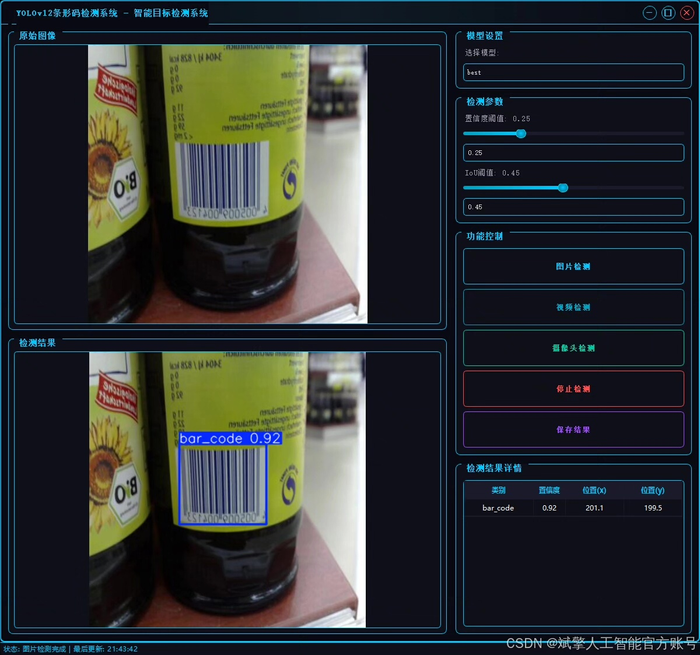
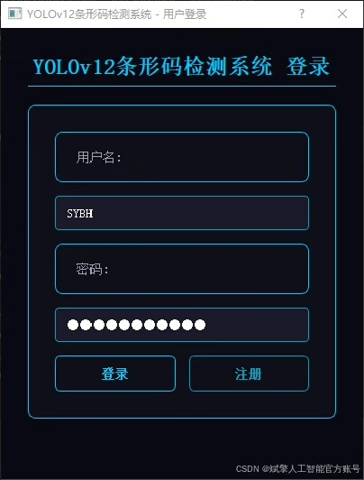
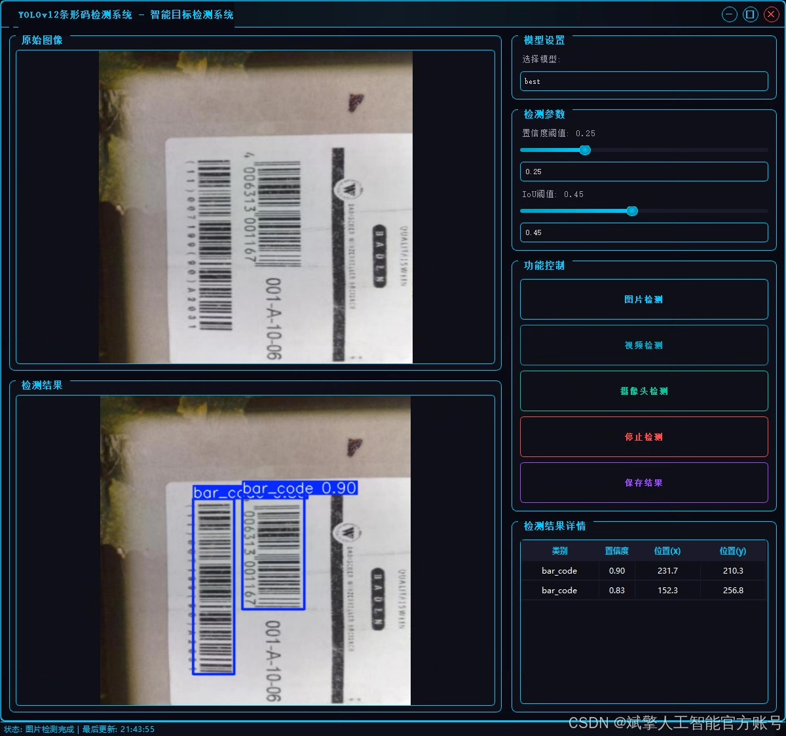
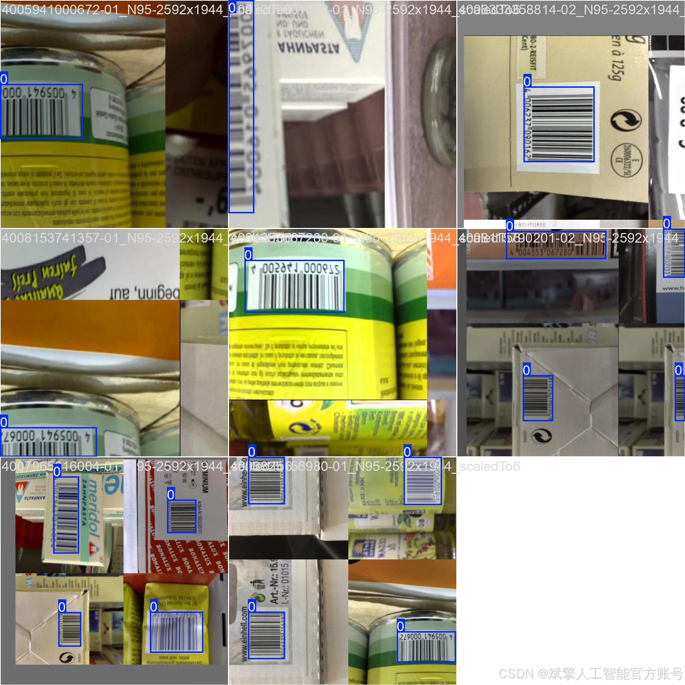
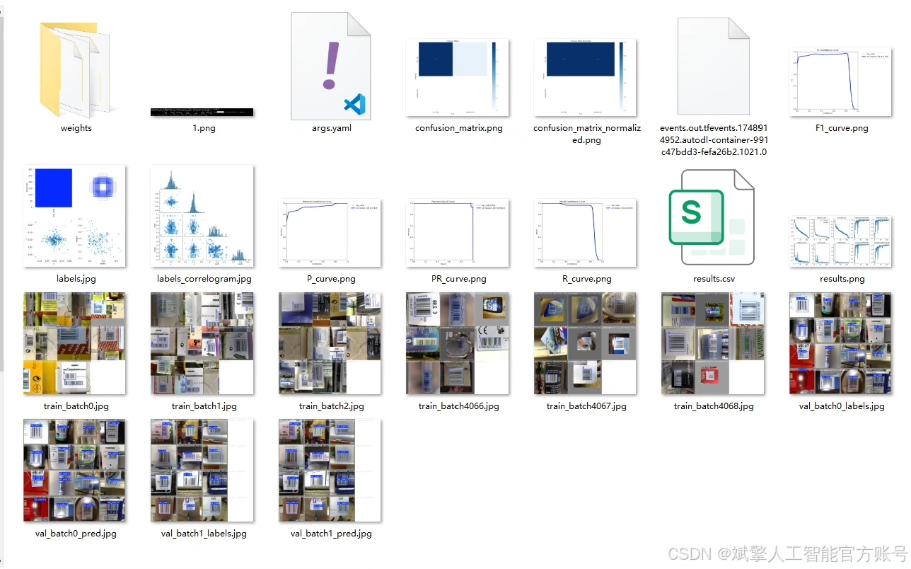
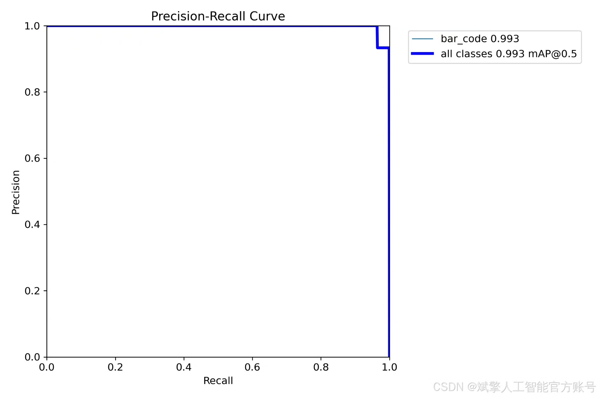
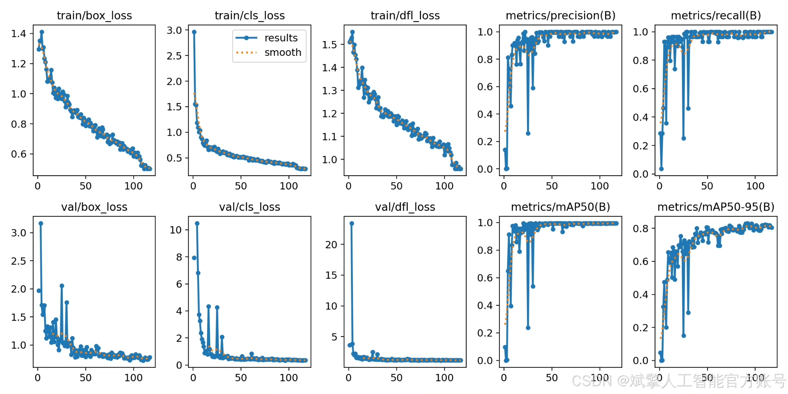
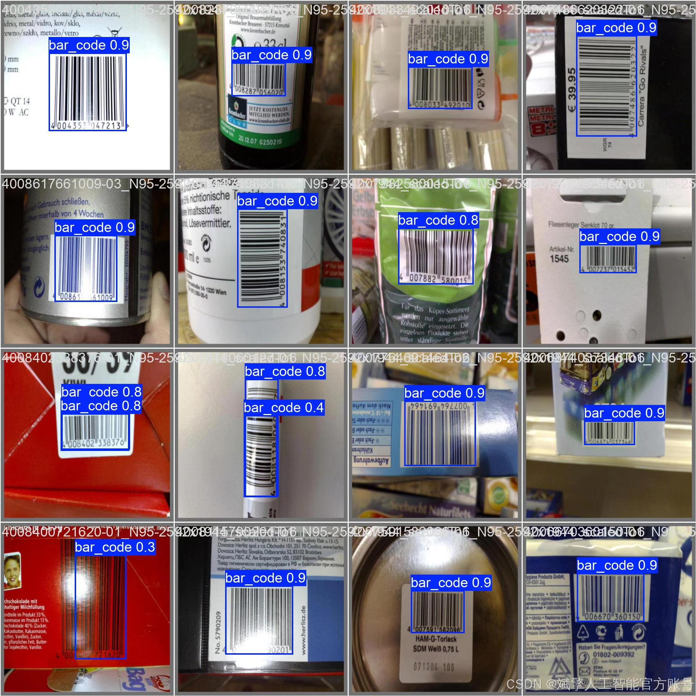

# YOLOv12 barcode detection system

## Body

YOLOv12 Barcode Detection System Based on Deep Learning YOLOv12 (YOLOv12+YOLO dataset + UI interface + login registration interface + Python project source code + model)

This project is based on the advanced YOLOv12 deep learning algorithm to develop an efficient and precise barcode detection system that can quickly locate and recognize various types of barcodes in complex backgrounds. The system integrates a self-built dataset in YOLO format (covering different lighting, angles, and occlusion scenarios), achieving an accuracy rate of over 99%. The frontend uses an intuitive PyQt5 UI interface, integrating login registration functions to ensure user permission management. The back end is implemented using the Python+PyTorch framework for model training and inference deployment, providing real-time detection, processing, and result visualization capabilities.

Dataset:
nc:1 class,
name: ['bar_code'],
dataset quantity: training set 301, validation set 28.

✅ User login registration: Supports password detection and security verification.
✅ Three detection modes: Based on the YOLOv12 model, supports image, video, and real-time camera detection, accurately recognizing targets.
✅ Dual-screen comparison: Displays the original scene and detection results simultaneously on the screen.
✅ Data visualization: Real-time table displaying the category, confidence, and coordinates of detected targets.
✅ Intelligent parameter adjustment: Offers a confidence slide bar to dynamically optimize detection accuracy, adapting to different scene needs.
✅ Sci-fi style interaction interface: Dark theme combined with dynamic light effects, reducing visual fatigue and improving operational experience.

## Images

## Payment

Here is a pay link on Stripe ( https://buy.stripe.com/3cs8yP7sY87d0vu9AB ). Please contact me lonlonago@foxmail.com after funding $89, and I will send you a complete data files , thank you!

